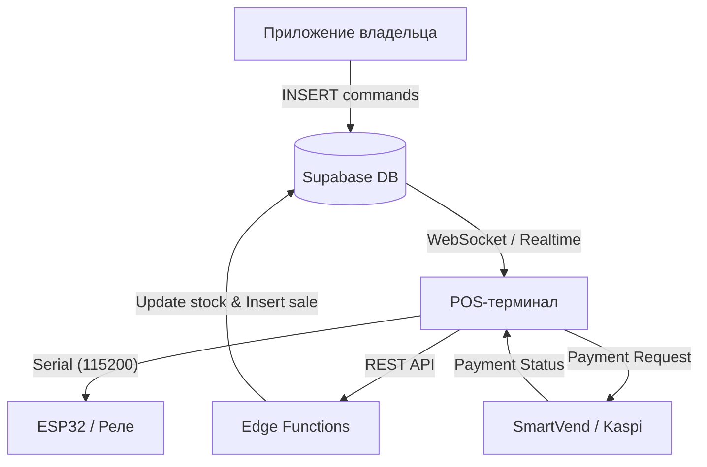

# Архитектура системы Micromarket

Данный документ описывает общую структуру системы, взаимодействие между компонентами и схему базы данных.

## Обзор компонентов

Система состоит из трех основных частей:
1.  **POS-терминал (pos_app)**: Android-приложение на Kotlin для планшета. Отвечает за интерфейс покупателя, прием платежей через Kaspi QR и физическое управление замком через USB-реле.
2.  **Приложение владельца (micromarket_app)**: Кроссплатформенное приложение на Flutter. Позволяет владельцу отслеживать продажи, остатки и удаленно открывать замок.
3.  **Backend (Supabase)**: Облачная база данных PostgreSQL, выполняющая роль «сердца» системы. Обеспечивает синхронизацию данных в реальном времени.

## Схема взаимодействия

## Схема базы данных

### Основные таблицы
- **`micromarkets`**: Информация о точках (ID, название, секретный ключ, владелец).
- **`inventory`**: Список товаров для каждой точки (название, цена, остаток, URL изображения).
- **`sales`**: Завершенные покупки (общая сумма, привязка к маркету).
- **`sales_items`**: Детализация чека (какие именно товары были куплены).
- **`commands`**: Очередь команд для терминала (например, удаленное открытие `open`).

## Безопасность и RLS

В системе настроены политики Row Level Security (RLS) в Supabase:
- **Анонимный доступ (anon)**: Терминалы могут только читать свои товары и команды, а также отправлять данные о продажах через Edge Functions.
- **Доступ владельца (authenticated)**: Владельцы видят только свои микромаркеты и связанные с ними данные о продажах/инвентаре.

## Edge Functions

- **`process_kiosk_sale`**: Принимает данные о продаже от терминала, проверяет секретный ключ, создает запись о продаже и **автоматически списывает остатки** в таблице `inventory`.
