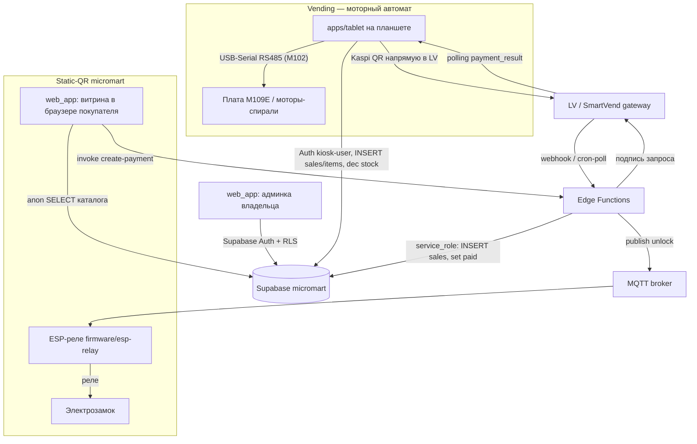

# Архитектура системы SmartVend

Обзор монорепозитория `smartvend-tablet`: приложения, прошивка и общий
бэкенд Supabase вокруг одного проекта Supabase `micromart`.

Этот документ — карта верхнего уровня. Детали платёжных потоков и разницы
между типами машин см. в [machine-types-and-payment-flows.md](machine-types-and-payment-flows.md).

---

## Два типа продающих устройств

Система обслуживает **два разных типа машин** в одной БД:

1. **Vending (моторный)** — снэк/напиток-автомат с моторными спиралями на
   плате M109E (M102-совместимая). Внутри стоит **планшет** с приложением
   `apps/tablet`. Платёж планшет проводит сам, выдачу делает мотор, падение
   товара ловит light-curtain.
2. **Static-QR micromart** — полка/холодильник с электрозамком и **без
   планшета**. Внутри только ESP-реле (`firmware/esp-relay`). Покупатель
   сканирует статический QR на корпусе, открывает в браузере телефона
   веб-приложение (`apps/web_app`), платит, и замок открывается по
   MQTT-команде от бэкенда.

Эти два потока **намеренно разделены** — их объединение в прошлом приводило
к незакрытым платежам. Подробности — в [machine-types-and-payment-flows.md](machine-types-and-payment-flows.md).

---

## Компоненты (структура монорепо)

```
apps/
  tablet/      Flutter — приложение планшета вендинга (моторные спирали,
               плата M109E/M102 через USB-Serial RS485). Сам проводит
               Kaspi QR оплату и крутит моторы. (ex-m102_tester)
  web_app/     Vite/React веб-приложение, единый деплой (Vercel).
               Два режима в одном коде:
                 • Админка владельца — каталог, цены, остатки, продажи (Admin.jsx)
                 • Витрина покупателя — открывается при скане статического
                   QR на static-QR машине (App.jsx)
               (ex-customer_web / admin)
  mmd_diag/    Flutter — диагностический клиент платы/устройства (ex-mmd)

firmware/
  esp-relay/   Прошивка ESP-реле для static-QR машин: слушает MQTT,
               щёлкает реле → открывает электрозамок (ex-esp_relay_mart)

supabase/      ЕДИНЫЙ бэкенд проекта `micromart`
  migrations/  История схемы БД (SQL по timestamp) — версионируется в git
  functions/   Edge-функции (оплаты, рефанды, cron)
  config.toml  Конфиг проекта Supabase

docs/          Документация и планы
  refs/        Вендорские справочники (протоколы M109E, API PDF)
tools/         Вспомогательные python-скрипты
release.ps1    Сборка/публикация APK планшета в GitHub Releases
```

> БД и данные живут **в облаке** Supabase, не в репозитории. В git — только
> исходники бэкенда (`migrations/`, `functions/`, `config.toml`). Секреты
> (`.env`, service_role, токены) не коммитим.

---

## Схема взаимодействия



---

## Схема базы данных

### Основные таблицы
- **`micromarkets`**: точки продаж (ID, название, тип `kind`, секрет, владелец `owner_id`, раскладка моторов `layout_json`).
- **`inventory`**: товары точки (название, цена, остаток `stock`, привязка к мотору `motor_id`, изображение).
- **`sales`**: завершённые продажи (сумма, привязка к маркету, `payment_id`).
- **`sales_items`**: позиции чека (товар, `result_code`/`dispensed` для vending).
- **`pending_orders`**: заказы static-QR в ожидании оплаты (серверная корзина, статус `pending`/`paid`).
- **`commands`**: очередь команд (например удалённое открытие).

---

## Edge Functions

Обслуживают преимущественно **static-QR флоу** (где платёж инициируется с
телефона покупателя и подтверждается на бэкенде):

- **`create-payment`**: проверяет цены/маркет на сервере, создаёт `pending_orders`, подписывает запрос в LV (`levending.smartvend.kz/payment_request`), возвращает `paymentUrl`.
- **`verify-payment`**: проверяет статус оплаты в LV (`/payment_result`); учитывает, что ESP уже мог финализировать заказ.
- **`complete-order`**: финализирует заказ после подтверждённой оплаты.
- **`cron-process-payments`**: периодический поллинг LV для висящих `pending_orders` (fallback, если webhook недоступен).
- **`process-refunds`**: автоматические возвраты при несостоявшейся выдаче.
- **`process_kiosk_sale`**: для **vending** — принимает продажу от планшета, проверяет секрет, пишет продажу и списывает остатки в `inventory`.

---

## Безопасность и RLS

Три identity-роли (подробно в [machine-types-and-payment-flows.md](machine-types-and-payment-flows.md#identity-модель-три-роли)):

- **Owner** — `web_app` админка, Supabase Auth по email/паролю, видит только свои машины (`owner_id = auth.uid()`).
- **Kiosk** (только vending) — `apps/tablet`, Supabase Auth `kiosk-{machid}@local.smartvend`, пишет `sales`/`sales_items` и правит `stock` только своей машины.
- **Customer** (static-QR) — браузер покупателя, anon role, **в БД не пишет**: каталог читает, все мутации идут через edge-функции с service_role.

ESP-реле не работает с Supabase напрямую — авторизуется в MQTT-брокере
(mTLS или username/password) и слушает топик разблокировки.
