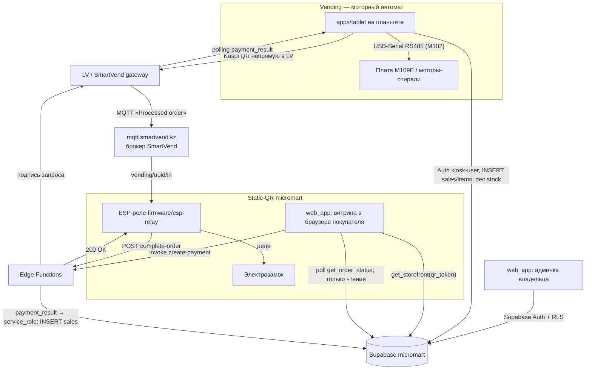

# Архитектура системы SmartVend

Обзор монорепозитория `smartvend-tablet`: приложения, прошивка и общий
бэкенд Supabase вокруг одного проекта Supabase `micromart`.

Этот документ — карта верхнего уровня. Детали платёжных потоков и разницы
между типами машин см. в [machine-types-and-payment-flows.md](machine-types-and-payment-flows.md).

---

## Два типа продающих устройств

Система обслуживает **два разных типа машин** в одной БД:

1. **Vending (моторный)** — снэк/напиток-автомат с моторными спиралями на
   плате M109E (M102-совместимая). Внутри стоит **планшет** с приложением
   `apps/tablet`. Платёж планшет проводит сам, выдачу делает мотор, падение
   товара ловит light-curtain.
2. **Static-QR micromart** — полка/холодильник с электрозамком и **без
   планшета**. Внутри только ESP-реле (`firmware/esp-relay`). Покупатель
   сканирует статический QR на корпусе, открывает в браузере телефона
   веб-приложение (`apps/web_app`), платит, и замок открывается по
   MQTT-команде от бэкенда.

Эти два потока **намеренно разделены** — их объединение в прошлом приводило
к незакрытым платежам. Подробности — в [machine-types-and-payment-flows.md](machine-types-and-payment-flows.md).

---

## Компоненты (структура монорепо)

```
apps/
  tablet/      Flutter — приложение планшета вендинга (моторные спирали,
               плата M109E/M102 через USB-Serial RS485). Сам проводит
               Kaspi QR оплату и крутит моторы. (ex-m102_tester)
  web_app/     Vite/React веб-приложение, единый деплой (Vercel).
               Два режима в одном коде:
                 • Админка владельца — каталог, цены, остатки, продажи (Admin.jsx)
                 • Витрина покупателя — открывается при скане статического
                   QR на static-QR машине (App.jsx)
               (ex-customer_web / admin)
  mmd_diag/    Flutter — диагностический клиент платы/устройства (ex-mmd)

firmware/
  esp-relay/   Прошивка ESP-реле для static-QR машин: слушает MQTT,
               щёлкает реле → открывает электрозамок (ex-esp_relay_mart)

supabase/      ЕДИНЫЙ бэкенд проекта `micromart`
  migrations/  История схемы БД (SQL по timestamp) — версионируется в git
  functions/   Edge-функции (оплаты, рефанды, cron)
  config.toml  Конфиг проекта Supabase

docs/          Документация и планы
  refs/        Вендорские справочники (протоколы M109E, API PDF)
tools/         Вспомогательные python-скрипты
release-relay.ps1  Сборка/публикация прошивки ESP-реле в GitHub Releases
```

> БД и данные живут **в облаке** Supabase, не в репозитории. В git — только
> исходники бэкенда (`migrations/`, `functions/`, `config.toml`). Секреты
> (`.env`, service_role, токены) не коммитим.

---

## Схема взаимодействия


```mermaid
graph TD
    Owner[web_app: админка владельца] -- "Supabase Auth + RLS" --> DB[(Supabase micromart)]

    subgraph Vending[Vending — моторный автомат]
        Tablet[apps/tablet на планшете]
        M109E[Плата M109E / моторы-спирали]
        Tablet -- "USB-Serial RS485 (M102)" --> M109E
    end
    Tablet -- "Kaspi QR напрямую в LV" --> LV[LV / SmartVend gateway]
    LV -- "polling payment_result" --> Tablet
    Tablet -- "Auth kiosk-user, INSERT sales/items, dec stock" --> DB

    subgraph StaticQR[Static-QR micromart]
        Phone[web_app: витрина в браузере покупателя]
        ESP[ESP-реле firmware/esp-relay]
        Lock[Электрозамок]
        ESP -- "реле" --> Lock
    end
    Phone -- "get_storefront(qr_token)" --> DB
    Phone -- "invoke create-payment" --> Edge[Edge Functions]
    Edge -- "подпись запроса" --> LV
    Phone -- "poll get_order_status, только чтение" --> DB
    LV -- "MQTT «Processed order»" --> MQTT[mqtt.smartvend.kz<br/>брокер SmartVend]
    MQTT -- "vending/uuid/in" --> ESP
    ESP -- "POST complete-order" --> Edge
    Edge -- "payment_result → service_role: INSERT sales" --> DB
    Edge -- "200 OK" --> ESP
```

Ключевое в static-QR: **бэкенд ничего не шлёт устройству**. Реле подписано на
брокер SmartVend, а не на наш, и открывает замок само — но только получив 200
от `complete-order`, то есть после того, как оплата подтверждена и продажа
записана. Браузер покупателя платёж не закрывает: он лишь поллит
`get_order_status` и показывает успех, когда заказ закрыло устройство.

---

## Схема базы данных

### Основные таблицы
- **`micromarkets`**: точки продаж (ID, название, тип `kind`, секрет, владелец `owner_id`, раскладка моторов `layout_json`).
- **`inventory`**: товары точки (название, цена, остаток `stock`, привязка к мотору `motor_id`, изображение).
- **`sales`**: завершённые продажи (сумма, привязка к маркету, `payment_id`).
- **`sales_items`**: позиции чека (товар, `result_code`/`dispensed` для vending).
- **`pending_orders`**: заказы static-QR в ожидании оплаты (серверная корзина, статус `pending`/`completed`).
- **`products`** / **`categories`**: каталог SKU владельца, на который ссылается `inventory.product_id`.
- **`smartvend_machines`**: кэш публичного списка машин SmartVend (`machid`/`uuid`/`secret`), backend-only.
- **`profiles`**: легаси-таблица, приложениями не используется.

> Таблицы `commands` (очередь удалённых команд) в БД нет — она была удалена
> миграцией `20260526180000_drop_dead_objects…`. Канала от бэкенда к
> ESP-реле сейчас не существует вообще; если понадобится сервисное открытие
> из админки, его придётся заводить заново.

---

## Edge Functions

Обслуживают **static-QR флоу**:

- **`create-payment`**: пересчитывает сумму из `inventory` на сервере (клиентские цены игнорируются), создаёт `pending_orders`, подписывает запрос в LV (`levending.smartvend.kz/payment_request`) секретом машины, возвращает `paymentUrl`. Серверный фоновый поллинг в ней **намеренно выключен** — см. ниже.
- **`complete-order`**: единственный путь захвата платежа. Реле POST'ит `{orderid}`, функция дёргает `payment_result`, и только при подтверждении пишет `sales`/`sales_items` и списывает остатки. Замок открывается уже после ответа 200.
- **`device-provision`**: ESP-реле шлёт `machid` → получает свою MQTT-идентичность (`uuid`/`secret`/`name`) из публичного списка машин SmartVend (кэш `smartvend_machines`).

> **Почему захват один.** `payment_result` — не просто проверка статуса: если
> его не опросить примерно за минуту, SmartVend возвращает платёж сам. На этом
> и держится инвариант «деньги берутся только вместе с открытием замка»: реле
> офлайн → `payment_result` никто не дёргает → автовозврат, покупатель видит
> таймаут. Поэтому браузер платёж закрывать не должен, и `create-payment` не
> поллит в фоне — любой второй захват сломал бы инвариант, записав продажу без
> открытия двери.

Обслуживают **админку** (вызываются из браузера с токеном сессии оператора;
`verify_jwt=false`, авторизацию функции проверяют сами):

- **`admin-create-user`**: управление аккаунтами владельцев, только суперадмин (требует `app_metadata.is_superadmin = true`, см. миграцию `20260804120000_superadmin_role.sql`). `GET` — список аккаунтов + сколько машин у каждого; `POST {email, password}` — создание; `POST {action:'set_password'}` — установка нового пароля; `POST {action:'delete'}` — удаление аккаунта. Слаг остался историческим — переименовать функцию без CLI нельзя, старый эндпойнт остался бы жить.

> **Пароли задаются, а не высылаются.** `resetPasswordForEmail` требует SMTP, которого в проекте нет: встроенный отправитель Supabase лимитирован несколькими письмами в час и для боевого потока не предназначен. Аккаунт и так создаётся с паролем, который суперадмин передаёт лично, — сброс идёт тем же путём.
>
> Удаление аккаунта блокируется (409 `has_machines`), пока за ним числятся машины: у `micromarkets.owner_id` нет внешнего ключа на `auth.users`, поэтому удаление владельца оставило бы строки со ссылкой на несуществующего пользователя — такие машины не видны ни в одной админке. Сначала перенос, потом удаление. Удалить аккаунт, под которым вошёл, тоже нельзя.
- **`device-claim`**: регистрация машины, **только суперадмин** — вводится `Internal ID` + `Secret` из кабинета SmartVend, функция сверяет пару со списком SmartVend (кэш `smartvend_machines`, при промахе освежает из upstream) и вставляет строку `micromarkets` с `owner_id = auth.uid()`. `secret` пишется на сервере и обратно в браузер не отдаётся. Если у машины **уже есть владелец** — 409 `already_claimed` с его email, даже для суперадмина: перевешивание идёт только через `device-admin` → `transfer`, где UI называет оба аккаунта и спрашивает подтверждение. Строку без владельца присвоить можно.
- **`device-admin`**: управление всем парком, только суперадмин. `list` — все машины с email владельца, `transfer` — передать машину другому аккаунту, `rename`, `delete`. Нужна именно функция: RLS показывает `authenticated` только свои машины, поэтому чужие суперадмин из браузера не видит. В UI список не выводится плоско — машины сгруппированы по аккаунтам и раскрываются кликом по профилю; машины без владельца показываются отдельной группой внизу, иначе до них было бы не добраться.

> **`delete` разрушителен.** `inventory.micromarket_id` и `sales.micromarket_id` объявлены `ON DELETE CASCADE`, то есть удаление аппарата уносит и всю его историю продаж. Поэтому первый вызов всегда возвращает `409 confirm_required` со счётчиками строк, чтобы UI показал, что именно потеряется, и только повторный вызов с `confirm:true` удаляет. Незакрытые `pending_orders` (FK `NO ACTION`) удаление блокируют — деньги в полёте пропасть не должны.

Переименование машины владельцем идёт **не** через функцию, а обычным
`UPDATE micromarkets SET name` из браузера: политика `Owner manages
micromarkets` уже ограничивает `authenticated` своими строками.

---

## Провижининг: кто и как заводит аккаунты и машины

Заводит и аккаунты, и машины **только суперадмин**. Владелец получает готовую
машину — сам он её зарегистрировать не может.

Всё делается на одной вкладке **«Администрирование»** — она видна только
суперадмину и открывается у него первой.

```
Суперадмин (я)                                        Владелец            Машина
─────────────                                         ────────            ──────
1) «Новый пользователь»
      POST admin-create-user {email, password}
      → auth.users (email_confirm=true)               логинится
      пароль передаю лично, письма не шлём                │
                                                          │
2) «Добавить устройство»                                   │
      POST device-claim {machid, secret, kind}             │
      → сверка пары со списком SmartVend                   │
      → INSERT micromarkets (owner_id = я)                 │
                                                           │
3) клик по профилю → аппарат → «Перенести»                  │
      POST device-admin {action:'transfer', owner_id}       │
      → машина уходит владельцу ─────────────────────────►  │
                                                            │
                                    видит её в админке,     └── планшет/ESP
                                    правит каталог,             пэйрится по
                                    переименовывает             machid+secret
```

Суперадмин отличается от обычного владельца флагом `app_metadata.is_superadmin`
в `auth.users` — его пишет только `service_role`/прямой SQL, из браузера
подделать нельзя (в отличие от `user_metadata`). Имя ключа намеренно не `role`:
верхнеуровневый claim `role` PostgREST использует для выбора Postgres-роли.

Вкладка «Администрирование» и кнопка «Добавить устройство» у не-суперадминов
скрыты косметически — настоящие проверки живут внутри `admin-create-user`,
`device-claim` и `device-admin`, потому что все три это публичные HTTP-эндпойнты.

Владельцу остаётся ровно одна операция над самой машиной — **переименование**;
она идёт напрямую в таблицу под RLS, без функции.

### Удалённые функции

Из проекта убраны как неиспользуемые: `cron-process-payments` (задание
`pg_cron` снято миграцией `20260605120000`, `cron.job` пуст),
`verify-payment` (витрина ушла на пассивный `get_order_status`, а второй путь
захвата ломал бы инвариант «деньги вместе с замком»), `process_kiosk_sale` и
`process-refunds` (никогда не деплоились и ни на что не ссылались).
Соответствующие миграции остаются в истории — их не откатывали.

---

## Безопасность и RLS

Три identity-роли (подробно в [machine-types-and-payment-flows.md](machine-types-and-payment-flows.md#identity-модель-три-роли)):

- **Superadmin** — владелец платформы, флаг `app_metadata.is_superadmin`. Заводит аккаунты и машины, распоряжается всем парком через три админских edge-функции.
- **Owner** — `web_app` админка, Supabase Auth по email/паролю, видит только свои машины (`owner_id = auth.uid()`).
- **Kiosk** (только vending) — `apps/tablet`. Отдельного Supabase-пользователя у планшета **нет**: он работает под `anon` и пишет через `SECURITY DEFINER` RPC, которые проверяют пару `(machid, secret)` внутри (`_assert_machine`, миграции `20260603120000`–`20260603140000`). Прямые anon-записи закрыты миграцией `20260603170000_lockdown_revoke_anon_direct_access`.
- **Customer** (static-QR) — браузер покупателя, anon role, **в БД не пишет**: каталог читает через `get_storefront(qr_token)`, статус заказа — через `get_order_status`, все мутации идут через edge-функции с service_role.

ESP-реле работает и с брокером, и с Supabase: подписано на топик
`vending/<uuid>/in` брокера **SmartVend** (`mqtt.smartvend.kz:14003`, логин и
пароль получает от `device-provision`), а в Supabase ходит по HTTPS с
publishable-ключом — за провижинингом и в `complete-order`. Своего MQTT-брокера
у проекта нет, и обратного канала «бэкенд → реле» тоже.
